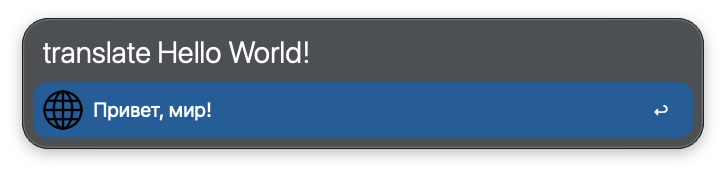
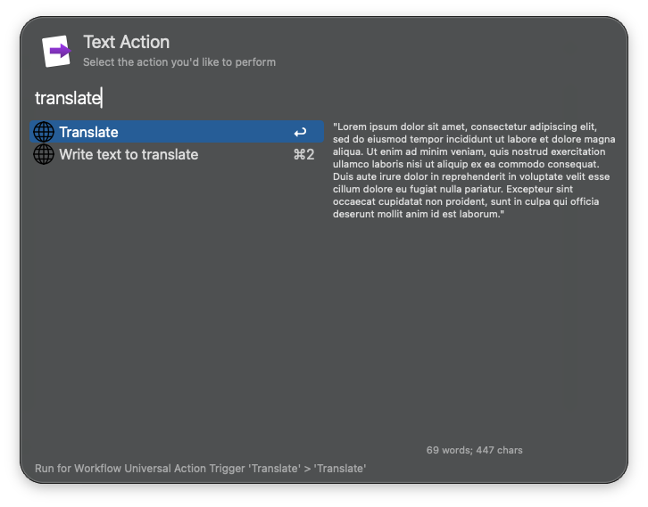

# Alfred workflow to translate texts

## Usage

Translate words or sentences to another language via the `t` keyword.

- <kbd>↩</kbd>: Copy the translated text to the clipboard.
- <kbd>⇧</kbd><kbd>↩</kbd>: Paste the translated text to the frontmost app.
- <kbd>⌥</kbd><kbd>↩</kbd>: Show the translated text in the `Text View`.
By default, translate any language to Russian, setup your language in the **workflow settings**.  
You can use it in Universal Actions! By typing "Translate"
Translate selected text via the [Universal Action](https://www.alfredapp.com/help/features/universal-actions/).

Configure the [Hotkey](https://www.alfredapp.com/help/workflows/triggers/hotkey/) for faster triggering.

Translate words or sentences to another language via the `translate` keyword. Tip: you may change it to `t` for easier access.

## Requirements

Tested on:

- Alfred 5
- Python 3
