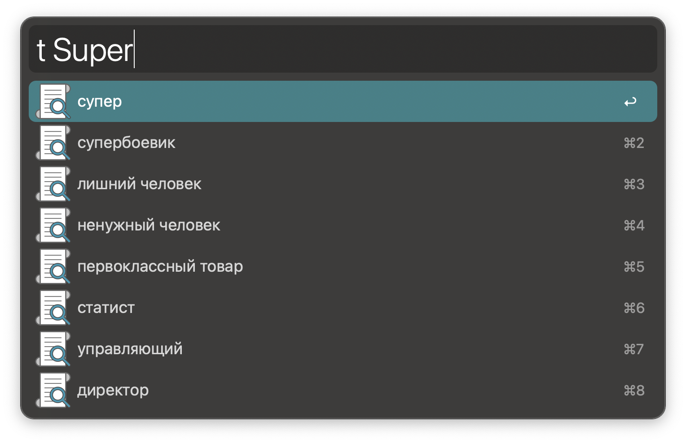

# Alfred workflow to translate texts
## Usage
Translate words or sentences to another language with Google Translate via the `t` keyword.

↩: Copy translate to the clipboard.  
By default, translate any language to Russian, setup your language in the **workflow settings**.
